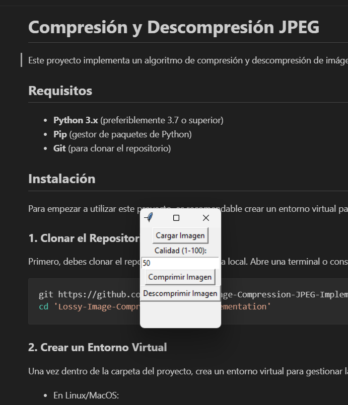
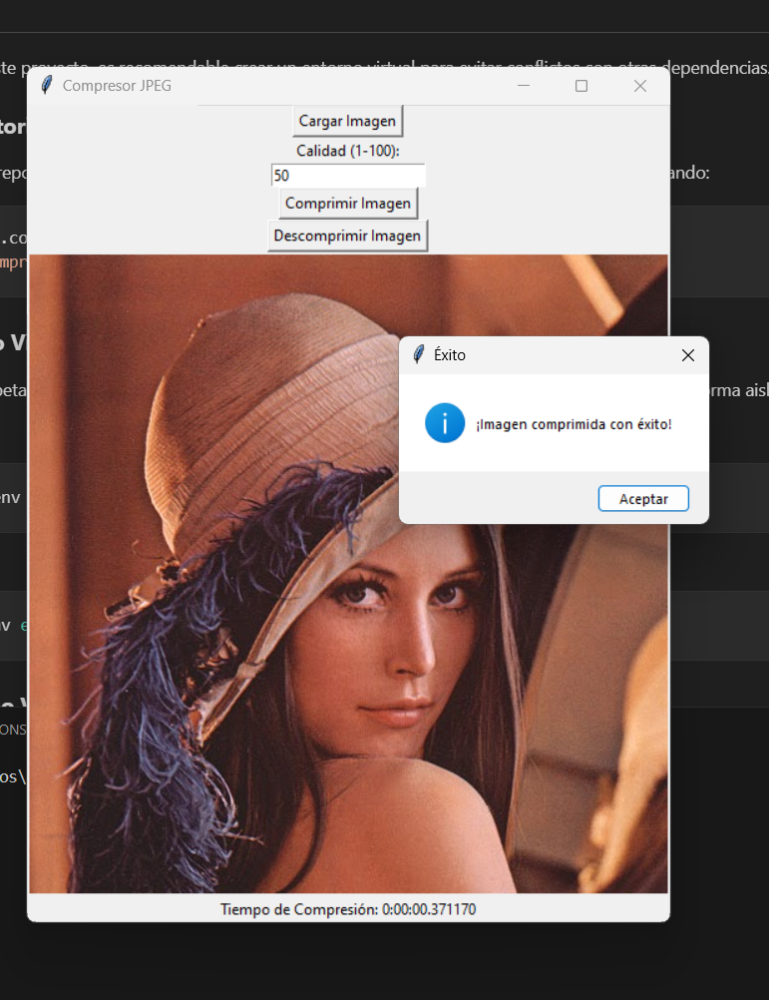
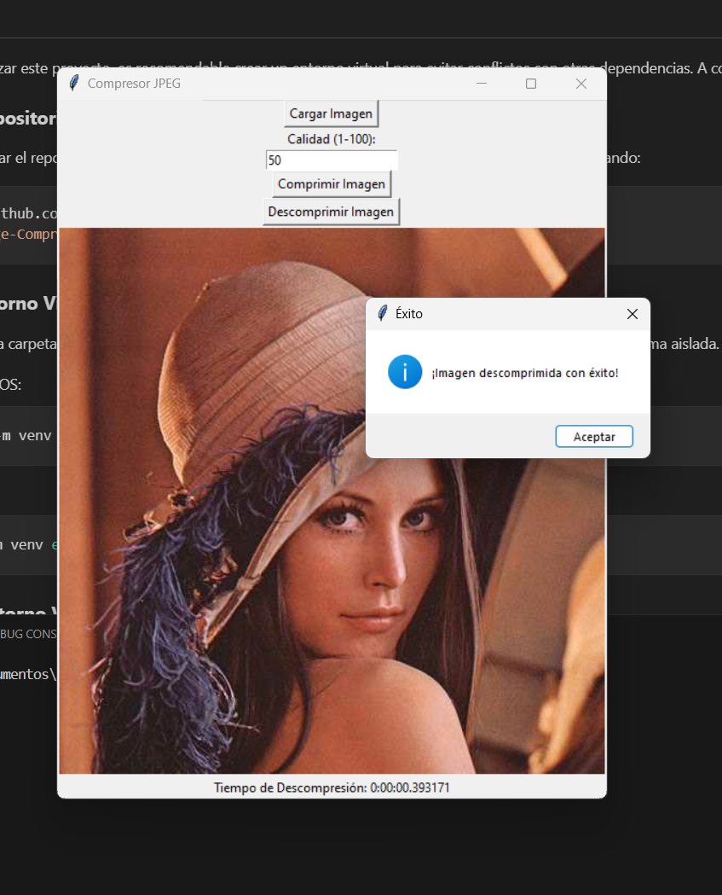
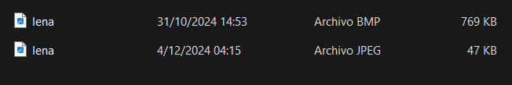

# **Compresión y Descompresión JPEG**

Este proyecto implementa un algoritmo de compresión y descompresión de imágenes en formato JPEG utilizando Python. A través de este proceso, reducimos el tamaño de las imágenes logrando mantener calidad en ella.

## **Requisitos**

- **Python 3.x** (preferiblemente 3.7 o superior)
- **Pip** (gestor de paquetes de Python)
- **Git** (para clonar el repositorio)

## **Instalación**

Para empezar a utilizar este proyecto, es recomendable crear un entorno virtual para evitar conflictos con otras dependencias. A continuación se describen los pasos de instalación:

### **1. Clonar el Repositorio**

Primero, debes clonar el repositorio en tu máquina local. Abre una terminal o consola y ejecuta el siguiente comando:

```bash
git https://github.com/n4ndp/Lossy-Image-Compression-JPEG-Implementation.git
cd 'Lossy-Image-Compression-JPEG-Implementation'
```

### **2. Crear un Entorno Virtual**

Una vez dentro de la carpeta del proyecto, crea un entorno virtual para gestionar las dependencias del proyecto de forma aislada. Ejecuta los siguientes comandos:

- En Linux/MacOS:
  ```bash
  python3 -m venv env
  ```

- En Windows:
  ```bash
  python -m venv env
  ```

### **3. Activar el Entorno Virtual**

#### **En Linux/MacOS:**
```bash
source env/bin/activate
```

#### **En Windows:**
```bash
.\env\Scripts\activate
```

Verás que el nombre del entorno virtual (`env`) aparece al principio de la línea de tu terminal, lo que indica que el entorno está activo.

### **4. Instalar las Dependencias**

Con el entorno virtual activado, ahora instala las dependencias del proyecto. Ejecuta:

```bash
pip install -r requirements.txt
```

Este comando instalará todas las librerías necesarias para ejecutar el proyecto. Si no tienes el archivo `requirements.txt`, puedes instalar las dependencias manualmente. Las principales bibliotecas que utiliza este proyecto son:

- `numpy`
- `opencv-python`
- `tkinter`
- `Pillow`

### **5. Ejecutar el Proyecto**

Una vez que todas las dependencias estén instaladas, puedes ejecutar el proyecto. Si el script principal es un archivo llamado `app.py`, simplemente ejecuta el siguiente comando:

```bash
python app.py
```

### **6. Desactivar el Entorno Virtual**

Cuando hayas terminado de trabajar en el proyecto, puedes desactivar el entorno virtual ejecutando:

```bash
deactivate
```

Esto cerrará el entorno virtual y te devolverá a tu entorno global de Python.

## **Uso**

1. **Abrir la Aplicación:**
   Al ejecutar el archivo `app.py`, se abrirá una interfaz gráfica. La ventana inicial tendrá las opciones para cargar una imagen, comprimirla o descomprimirla.

   **Vista inicial de la aplicación:**
   

2. **Comprimir una Imagen:**
   - Selecciona una imagen desde tu sistema utilizando el botón **"Cargar Imagen"**.
   - Presiona el botón **"Comprimir"** para iniciar el proceso.
   **Vista al comprimir:**
   

3. **Descomprimir una Imagen:**
   - Carga un archivo comprimido generado por la aplicación utilizando el botón **"Cargar Imagen Comprimida"**.
   - Presiona el botón **"Descomprimir"** para reconstruir la imagen original.
   
   **Vista al descomprimir:**
   

## **Resultados**

A continuación se muestra un ejemplo de los tamaños de la imagen original y la imagen comprimida:
   
  

1. **Imagen Original:**
   - Tamaño: 769 KB
   - Resolución: 512512 px

2. **Imagen Comprimida:**
   - Tamaño: 47 KB
   - Resolución: 512512 px

El proceso de compresión logra reducir significativamente el tamaño del archivo sin una pérdida considerable de calidad, lo que hace que este método sea ideal para el almacenamiento y la transferencia de imágenes.
